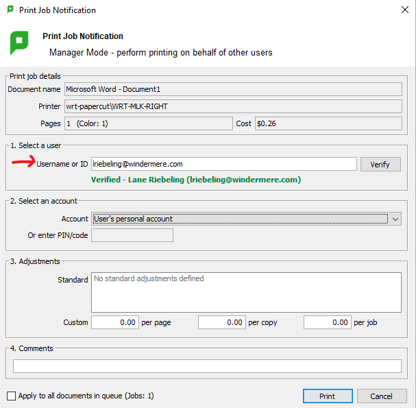
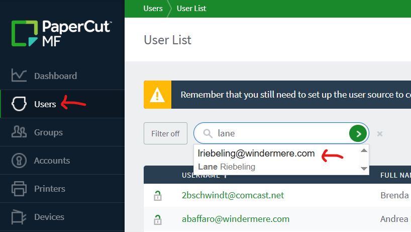
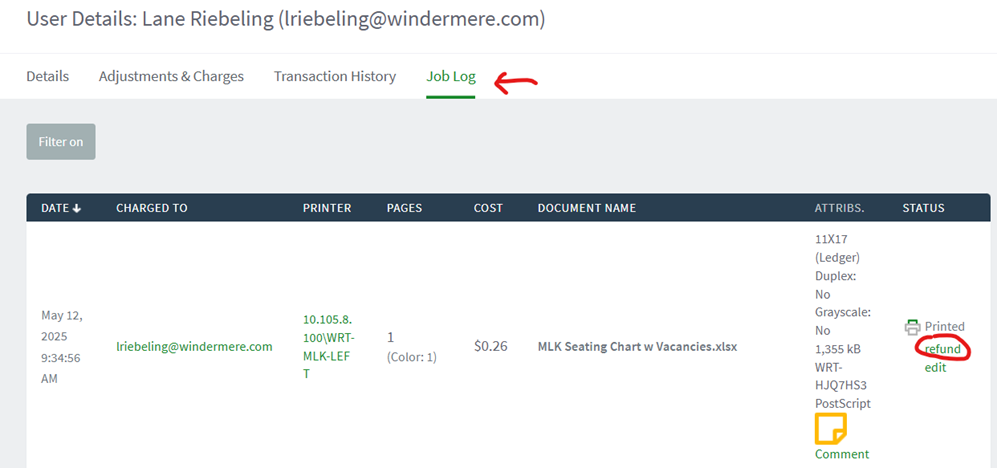
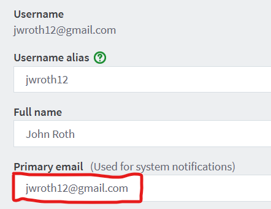
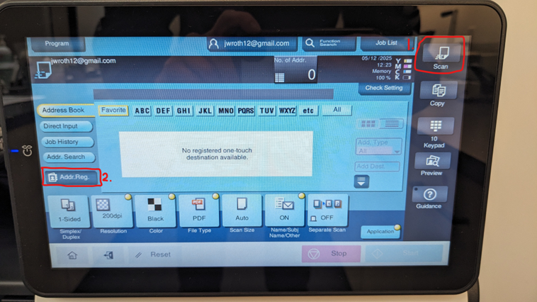
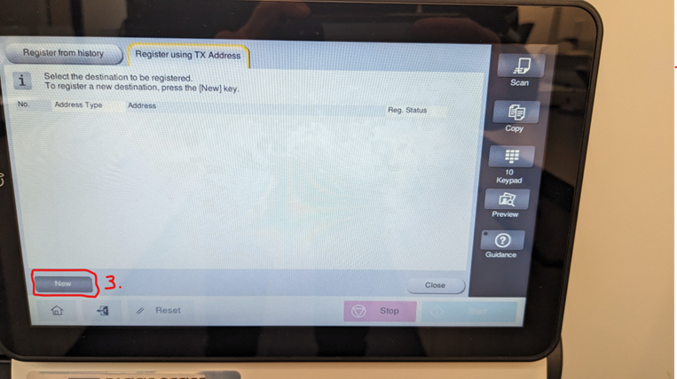
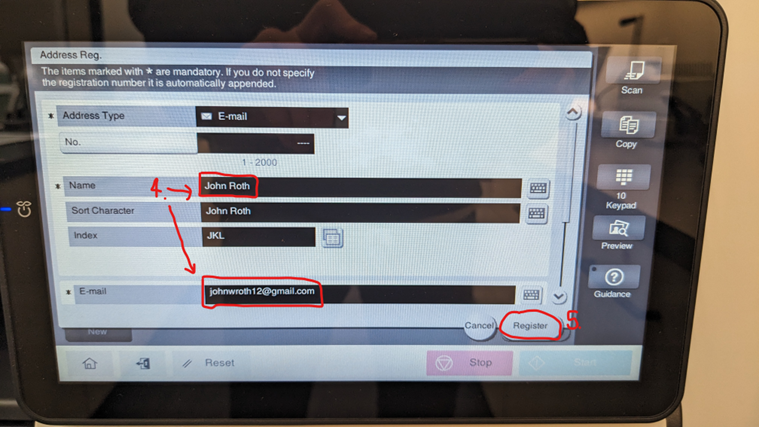

# Papercut Guides & Resources

## Contents
2. [Adding a New User in the Papercut MF Admin Portal](#adding-a-new-user-in-the-papercut-mf-admin-portal)  
    a. [Admin Portal Link](#here-is-the-admin-portal-link-for-quick-reference)
1. [Installing Papercut on PC/Mac](#installing-papercut-on-pc-mac)  
    a. [Printing from Chromebooks](#printing-from-chromebooks)  
    b. [Printing from Phone/Tablet](#printing-from-phone-tablet-ios-android)
3. [Printing on behalf of Agents](#printing-on-behalf-of-agents)
4. [Refunds](#refunds)
5. [Scanning - Issues with Email Delivery](#scanning-issues-with-email-delivery)  
    a. [Adding Email to Printer Address Book](#to-add-agent-s-email-to-the-address-book-on-the-printer)

## Adding a New User in the Papercut MF Admin Portal
Here is the guide to add a new user in Papercut:  
[Written Guide](https://www.canva.com/design/DAGJ7TbUj3c/RJ94n1_FGE-noaXTMMOzLw/edit?utm_content=DAGJ7TbUj3c&utm_campaign=designshare&utm_medium=link2&utm_source=sharebutton)  
#### Here is the Admin Portal link for quick reference
http://10.0.0.200:9191/admin  
**Username:** pcadmin  
**Password:** acdi1234

## Installing Papercut on PC/Mac
Below are guides to install the Papercut software on PC and Mac. This is necessary when an agent joins WRT, or an existing agent gets a new computer.

::: tip New Agents
If this is for a new agent, before logging the agent in, you will need to [add them as a new user in the Papercut Admin Portal](#adding-a-new-user-in-the-papercut-mf-admin-portal)
:::
::: tip Teams/Assistants
For agent teams, usually only one agent is billed for the whole team's printing. Check the [Admin Portal](http://10.0.0.200:9191/admin) to see which user on the team has an account (usually the Principal Broker). Similarly, assistants do not have their own Papercut accounts; their Principal Broker will be the account-holder. So, team members/assistants can sign into Papercut with their PB's account.
:::

**Install Papercut on PC**  
[Written Guide](https://www.canva.com/design/DAGIha6L88k/EQVFT18i0Ud0WJrXmwzzSg/edit?utm_content=DAGIha6L88k&utm_campaign=designshare&utm_medium=link2&utm_source=sharebutton)  
[Video Guide](https://www.loom.com/share/98a486aa94004ee783e0cfa9070e5d41?sid=f00680f4-45fc-4b70-9eb2-3ebbd0a25d00)  

**Install Papercut on Mac**  
[Written Guide](https://www.canva.com/design/DAGJ6ugsWkk/mDPO0rD1o9TGNRWT9KssKA/edit?utm_content=DAGJ6ugsWkk&utm_campaign=designshare&utm_medium=link2&utm_source=sharebutton)  
[Video Guide](https://www.loom.com/share/75b239615bb84db7a3eee49b00871056?sid=cd4bfb33-215c-401c-8b77-23b4dadf61b3)

## Printing from Chromebooks
Printing from Chromebooks is currently not available. So far there has not been enough of a need to warrant the feature setup. If the need arises, put in a ticket with Sentry to get this feature set up.   

[To print from a Chromebook, add the [Papercut Chrome Extension](https://chromewebstore.google.com/detail/mobility-print/ndakideadaglgpbblmppfonobpdgggin?hl=en) on the agent’s Chromebook. The agent will need to log in the first time they print (remember, password is their printer code x2).]

## Printing from Phone/Tablet (iOS & Android)
Agents can also print to Papercut printers from their iOS & Android devices (this includes iPhones, iPads, Android phones, and Android tablets).  
  
[Here are the instructions](https://www.canva.com/design/DAGJL56iRkE/284orMFVLY1eZaOl8DCPrg/edit?utm_content=DAGJL56iRkE&utm_campaign=designshare&utm_medium=link2&utm_source=sharebutton) to print and post in your resource room. (Please make a copy of the Canva doc, and edit the doc to specify your own office’s printer(s)). The process for iPhones/iPads can be finnicky; it often takes two print attempts the first time around to be successful.

## Printing on behalf of Agents
All BSS’s are set up with “Manager Mode” – that means you see the below popup each time you print.  
  
The popup will default to your own account, so if you want to print on your own account you can just click “print” on the popup.  
  
If you want to print to an agent’s account, under “1. Select a user” - put either their username (in most cases, this is their email) or their printer code (4 digits). You can click “verify” to make sure you got the correct identifier, but not necessary. Click “print” and the job will be charged to the agent’s account.

::: tip Manager Mode
The manager mode popup must be set up separately on each device you use; if you are not seeing the popup on one of your devices, put in a ticket with Sentry and have them install the Papercut MF client on your device.
:::

## Refunds
When agents make misprints (for example, settings are incorrect, or color print comes out on the wrong paper), they may ask to be refunded for the misprints. The easiest way to visit the [Papercut Admin Portal](http://10.0.0.200:9191/admin), select “users” on the left, search the user and click on their account. Click on “Job Log” and find the job to be refunded, then click “refund” on the job.
  

  

This process refunds the entire job. **If you need to do a partial refund**, click “edit” (under “refund”), and subtract the number of pages you want to refund from the **color pages** field. Click "Apply."  

You can update the cost field as well, but note that **dollar amounts in Papercut are not used to calculate print charges on agent statements**. The reports are done entirely from **color page counts**, so if you need to make any edits, make sure you are always updating the number of color pages.

## Scanning - Issues with Email Delivery
For most users, the easiest way to scan to themselves is to select the “Me” quick destination on the main Scan page on the printer. However, we run into issues when the user has a gmail (or a vanity email provided by gmail) as the “primary email” in their Papercut account.  

Because the scan is sent “from” the primary email, gmail thinks someone is trying to impersonate the user and blocks the email.  

**The quickest and most direct fix** for this issue is to simply **delete the primary email** (shown below) in the [Papercut Admin Portal](http://10.0.0.200:9191/admin). Then, the scan will be sent “from” the office email, instead of the user’s own email, which looks perfectly legit to gmail.  

Just make sure that the **agent’s email is in the printer’s address book** – if it’s not, add it (photos below show how).  

^ Delete the primary email, then scroll down and click "Apply" to save.  

::: tip Alternate Fix
The other option to fix this issue is to change the agent’s primary email to their Windermere email, so that the scan is sent from their Windermere email. If they use the “Me” quick destination to send to, it will be sent to their Windermere email, so you need to make sure their Windermere email is forwarding to their gmail/vanity email. You can email emailsupport@windermere.com to check/set this for you, if the agent is unable to get into their Windermere email themselves.
:::  

#### To add agent's email to the address book on the printer:
1. Tap "Scan"
2. Tap "Addr. Reg."
  

3. Tap "New"
  

4. Enter Name and Email
5. Tap "Register"
  

The address is filed under the first letter in the “Name” field. Now the process for the agent to scan is:
1. Log into printer
2. Tap "Scan"
3. Tap letter in address book where their name/email is filed, then tap name
4. Set other preferences (b&w/color, 1-sided/2-sided) and tap "Start"